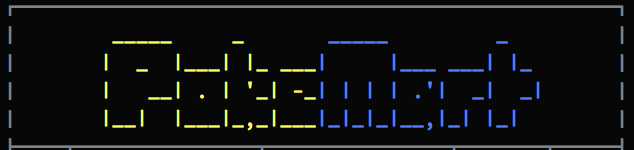
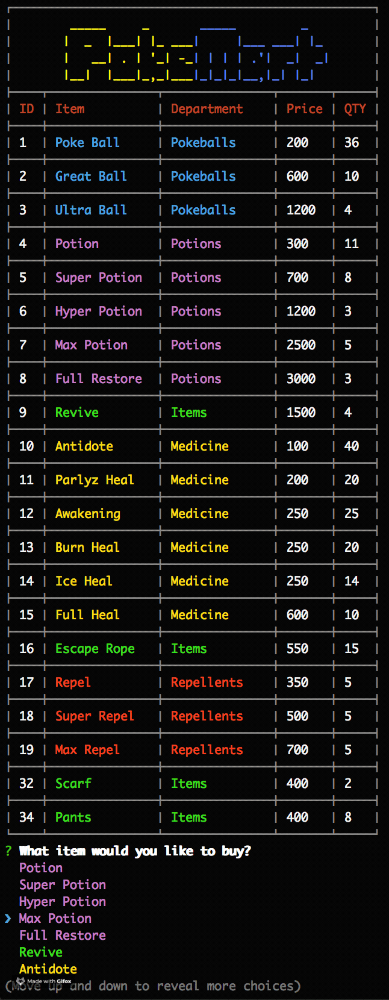
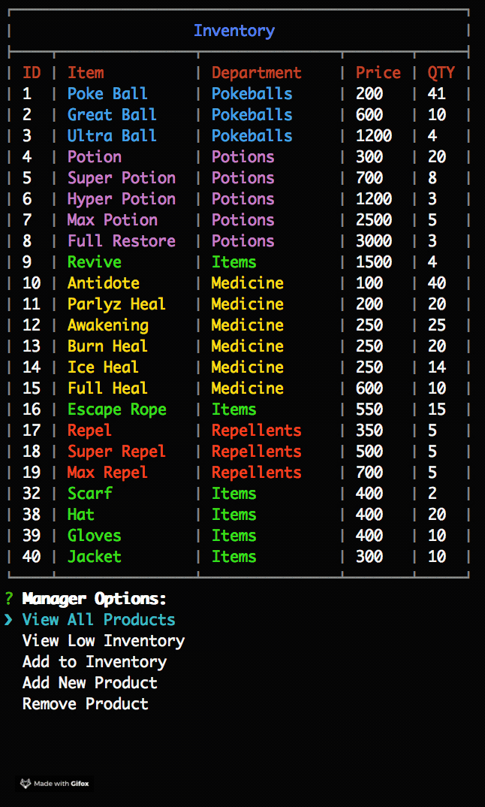
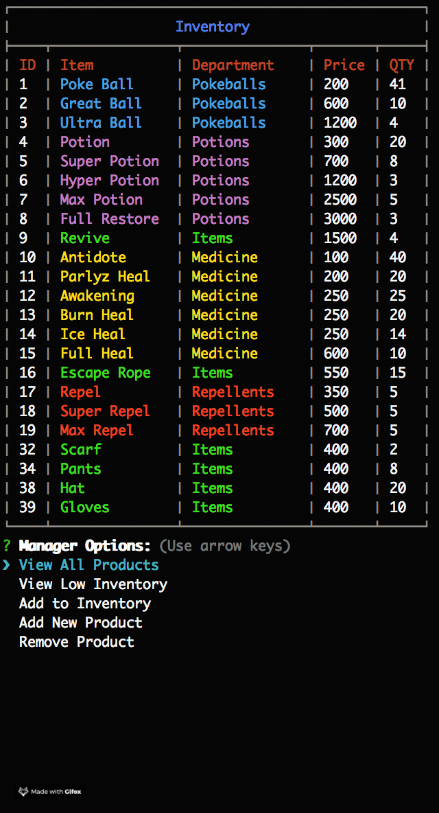
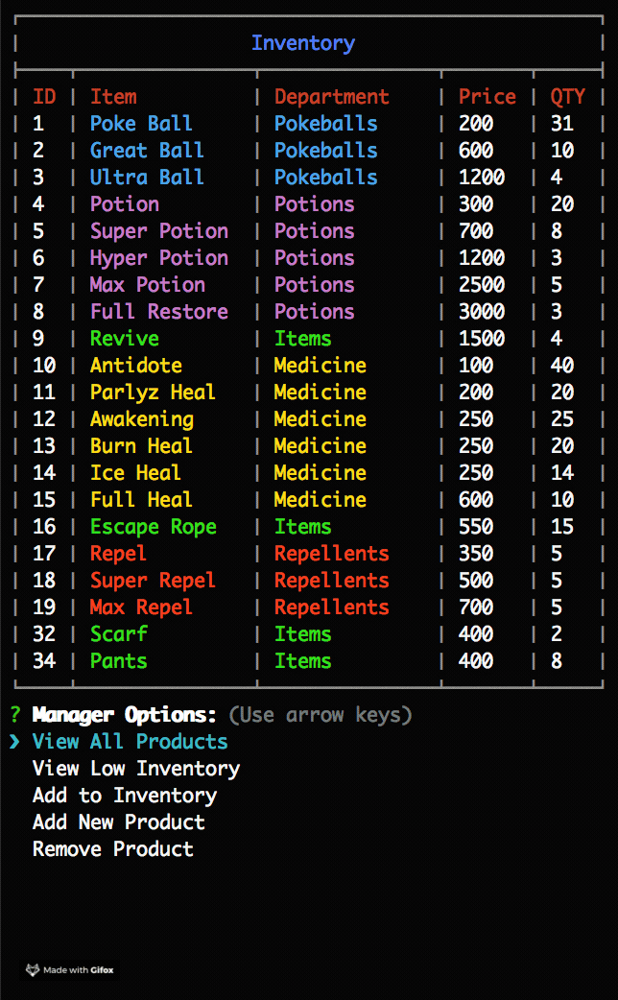
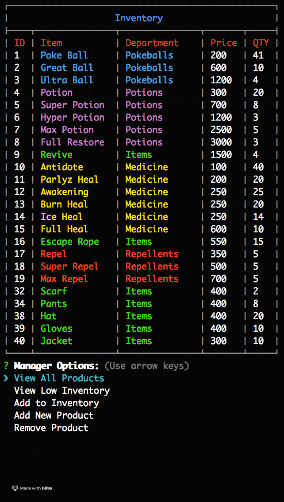

## PokeMart

An interactive command line store. MySQL and Node.JS are used to allow users to purchase items as a customer, and view, track and update the product inventory using the store manager view. 

## Customer View

The customer view allows users to view the current items available for purchase. The user may then select an item using the arrow keys, give a quantity of that item they wish to purchase, and if enough inventory is in stock, a receipt showing their total is then generated.  

## Manager View
The manager view allows managers to view and edit the store inventory. 

